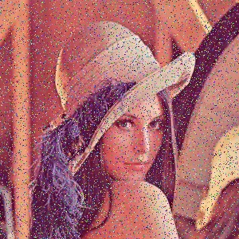

# Visual Snow
Working on a solution to removing the noise from visual snow.

## Problem:
Normal Human Vision:

Daily Vision with Visual Snow:
s

Daily Vision with Visual Snow while eyes are shut:

The added noise to the image is constant.

## Solution
1. Identify a the set of eeg signals that correspond to vision with complete darkness as a baseline.
2. Identify the a set of eeg signals that correspond to vision with visual snow while eyes are shut (a.k.a. the presence of visual activity when eyes are shut)
3. Train a neural network to detect patterns of visal snow. 
4. Define an algorithm to send a signal to counter-act the activity of these neurons.

## References
[Noise Removal in colored Images using Median Filter](https://www.youtube.com/watch?v=GCC52JCBbX0)